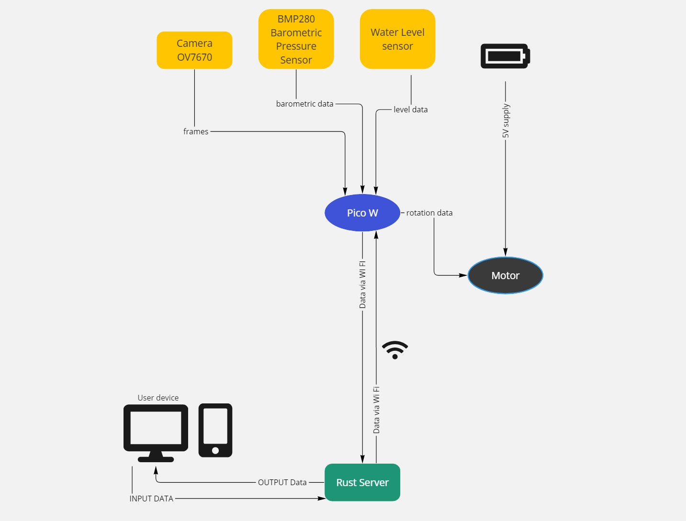

# Project Name

:::info

**Author**: FINICHIU Eduard Adelin \
**GitHub Project Link**: https://github.com/UPB-FILS-MA/project-EdwardAdelin.git

:::

## Description

I grew up with pets and animals around the house.
I was always upset because, as a family, we were very often not able to travel due to the need of finding someone that was able to feed the pets while we were in vacation.
That`s why I decided to create a Pet Feeder. It is a simple way to feed you pet and at the same time enjoy the holidays with family.
You just put some food in the Pet Feeder and the robot will feed your pet when he is very hungry.

## Motivation

I think that this would be a good solution for real-life problems that I have encountered. Even if it might come out as a really silly project, I`ll have fun using the hardware that I have bought.

## Architecture

Main Components:



Raspberry Pico: Acts as the central processing unit for the Pet Feeder, controlling the sensors and motors.
Barometric Sensor BMP280: Will be used to calculate temperature and pressure.
Camera OV7670: Used for capturing real time images.
Water Level Sensor: Detects if the minimum water level of the pet`s water resources is reached.
Electric Motors: Drives the mechanism to dispense the pet food.
Wi-Fi Module: Facilitates communication with external devices.
Power Supply: Provides the necessary power to all components at 5V.

Connection Overview:

Raspberry Pico:
Connects directly to:
Camera for monitoring the pet. Camera sends data to the owner.
Barometric Sensor for checking the status of the temperature. Owner recives the temperature at certain time intervals.
Water Level Sensor: Triggers an alarm in case of system failure and ensures minimal water level.
Electric motors for controlling food dispensing.
Wi-Fi module for external communication.
Powered by the main power supply.

The food will be stored in a special container. Owner of the pet can monitor the pet via camera images. When food level is low, owner can trigger the electric motor that provides food for the pet.
If the owner forgets to feed the pet and water level reaches critical status, the Pet Feeder send an alarm to the owner.
Barometric sensor offers the possibility of checking room temperature.

This architecture ensures seamless interaction between the components, allowing for efficient monitoring and control of the PetFeeder via the Raspberry Pico.

## Log

<!-- write every week your progress here -->

### Week 6 - 12 May

### Week 7 - 19 May

### Week 20 - 26 May

## Hardware

Pico W - brain of the Pet Feeder
Motor - delivers food
BMP280 - recives barometric data
OV7670 - captures images
Water Level sensor - no water, no current continuity
Power Supply - 4 \* R6 1.5V battery and a voltage divider to go at 5V

### Schematics

Place your KiCAD schematics here.

### Bill of Materials

<!-- Fill out this table with all the hardware components that you might need.

The format is
```
| [Device](link://to/device) | This is used ... | [price](link://to/store) |

```

-->

| Device                                                                                                               | Usage                  | Price                                                                                                                      |
| -------------------------------------------------------------------------------------------------------------------- | ---------------------- | -------------------------------------------------------------------------------------------------------------------------- |
| [Rapspberry Pi Pico W](https://www.raspberrypi.com/documentation/microcontrollers/raspberry-pi-pico.html)            | The microcontroller    | [35 RON](https://www.optimusdigital.ro/en/raspberry-pi-boards/12394-raspberry-pi-pico-w.html)                              |
| ---------------------------------------------------------------------------------------------                        |
| [BMP280](https://cdn-shop.adafruit.com/datasheets/BST-BMP280-DS001-11.pdf)                                           | The barometric sensor  | [9 RON](https://www.optimusdigital.ro/en/pressure-sensors/1666-modul-senzor-de-presiune-barometric-bmp280.html)            |
| ---------------------------------------------------------------------------------------------                        |
| [OV7670 Camera](https://web.mit.edu/6.111/www/f2016/tools/OV7670_2006.pdf)                                           | Camera                 | [16 RON](https://www.optimusdigital.ro/en/optical-sensors/624-modul-camera-ov7670.html)                                    |
| ---------------------------------------------------------------------------------------------------------------      |
| [Servo Motor](http://www.ee.ic.ac.uk/pcheung/teaching/DE1_EE/stores/sg90_datasheet.pdf)                              | The servo motor        | [14 RON](https://www.optimusdigital.ro/en/servomotors/26-sg90-micro-servo-motor.html?search_query=servo+motor&results=196) |
| ---------------------------------------------------------------------------------------------------------------      |
| [Water level sensor](https://circuitdigest.com/microcontroller-projects/interfacing-water-level-sensor-with-arduino) | The water level sensor | [2 RON](https://www.optimusdigital.ro/en/others/272-senzor-de-nivel-al-apei.html)                                          |

## Software

| Library                                                    | Description                                       | Usage                                  |
| ---------------------------------------------------------- | ------------------------------------------------- | -------------------------------------- | ------------------------------------ |
| [tokio](https://docs.rs/tokio/latest/tokio/)               | runtime for writing reliable network applications | Used for speed of network applications |
| [pico sdk rust](https://docs.rs/pico-sdk/latest/pico_sdk/) | rust binding and wrappers                         | pico sdk for rust                      |
| [pwm](https://docs.rs/pwm-pca9685/latest/pwm_pca9685/)     | Pulse-width modulation                            | traits for the RP2040 microcontroller  | Used for controlling the servo motor |

## Links

<!-- Add a few links that inspired you and that you think you will use for your project -->

1. [link](https://www.youtube.com/watch?v=vKdQXICO-r0&ab_channel=MrFlashPick)
2. [link](https://www.youtube.com/watch?v=U7KqqlYaXgY&ab_channel=NicoleZhang)
3. [link](https://mi-home.ro/products/xiaomi-smart-pet-food-feeder)
   ...
